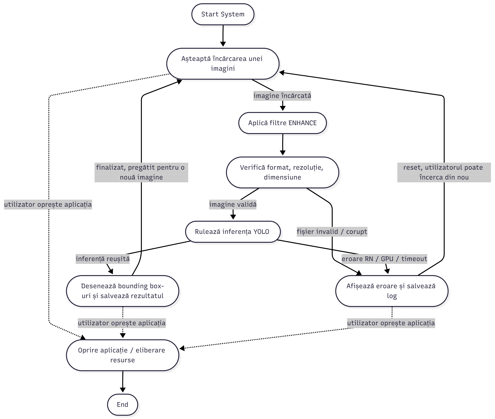
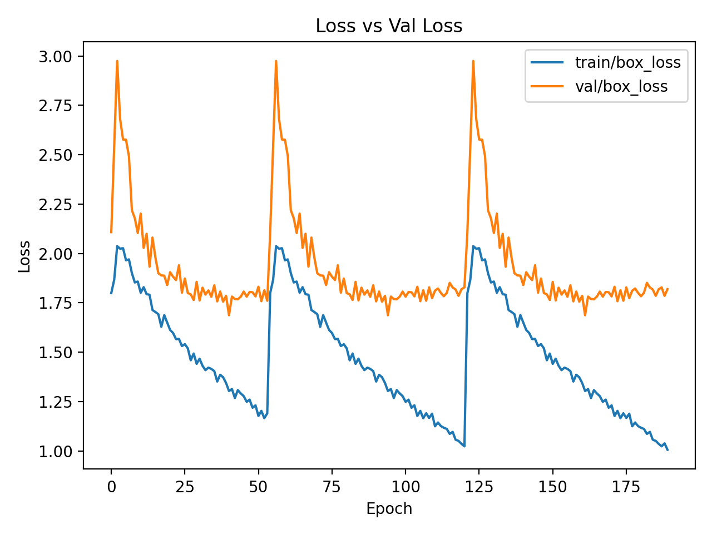
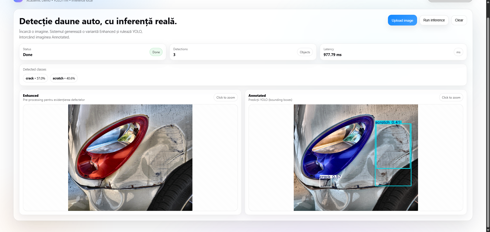

---
<div align="center">

# </h>🚗 **CAR DAMAGE DETECTION SYSTEM**</h>

## *Sistem inteligent pentru detecția daunelor auto folosind Rețele Neuronale*
</div>

<p align="center">
  
  
  
  
  
</p>

<p align="center">
  <b>Universitatea POLITEHNICA București</b><br>
  Facultatea de Inginerie Industrială și Robotică (FIIR)<br>
  Disciplina: <b>Rețele Neuronale</b><br><br>
  Student: <b>Baba Cristian Teodor</b><br>
  An universitar: 2025–2026
</p>

---

## 🌌 Introducere

Proiectul **Car Damage Detection System** reprezintă implementarea unui **sistem inteligent complet**, bazat pe **rețele neuronale convoluționale**, capabil să detecteze automat daunele vizibile ale unui vehicul dintr-o imagine digitală.

Sistemul nu se limitează la antrenarea unui model, ci acoperă **întregul ciclu de viață al unei aplicații bazate pe RN**:

* analiză și pregătire dataset,
* definirea arhitecturii software,
* antrenare și evaluare,
* inferență reală într-o aplicație funcțională.

---

## 🧠 Tipul problemei abordate

<table>
<tr><td><b>Tip problemă</b></td><td>Object Detection (Computer Vision)</td></tr>
<tr><td><b>Date de intrare</b></td><td>Imagini RGB cu vehicule avariate</td></tr>
<tr><td><b>Date de ieșire</b></td><td>Bounding box-uri + clasă + scor de încredere</td></tr>
<tr><td><b>Model RN</b></td><td>YOLO11m</td></tr>
</table>

---

## 🏷️ Clase de daune detectate

<p align="center">
  
  
  
  
  
  
</p>

Aceste clase au fost alese pentru a acoperi atât:

* **defecte structurale** (dent, crack),
* cât și **defecte funcționale** (lamp_broken, tire_flat).

---

# 📂 Structura actuală a proiectului

Structura reflectă implementarea reală și separarea clară a responsabilităților:

```
project-root/
├── config/
│   └── car_damage.yaml
│
├── data/
│   ├── images/
│   │   ├── train/
│   │   ├── val/
│   │   └── test/
│   │
│   └── images_enhanced/
│       ├── train/
│       ├── val/
│       └── test/
│
├── models/
│   └── trained_model.pt
│
├── results/
│   ├── training_history.csv
│   ├── test_metrics.json
│   └── hyperparameters.yaml
│
├── runs/
│   └── rn_train/
│
├── docs/
│   ├── loss_curve.png
│   └── screenshots/
│       └── inference_real.png
│
└── src/
    ├── preprocessing/
    │   └── enhance_images.py
    │
    ├── neural_network/
    │   ├── train.py
    │   ├── evaluate.py
    │   └── plot_loss_curve.py
    │
    └── app/
        └── main.py
```

---

# 🧪 **ETAPA 3 — Analiza și pregătirea setului de date**

Această etapă a avut rolul de a asigura **calitatea datelor**, fără a introduce artificii inutile.

### Aspecte cheie:

* dataset organizat strict în format YOLO;
* separare clară train / validation / test;
* etichete verificate manual;
* fără augmentări agresive.

### Preprocesare utilizată

✔ **ENHANCE (soft)**
✔ evidențiere defecte fine
✔ păstrarea fidelității imaginii originale

Această abordare minimizează riscul de **overfitting artificial**.

---
Perfect, rămânem **exact cu structura ta** 👍
Tot ce trebuie acum este să **integrezi elegant pozele** (grafic + diagramă) astfel încât README-ul să fie:

* 📘 academic (prof-proof)
* 🎬 cinematic (prima pagină „lovește”)
* 🧠 clar (pozele explică textul, nu îl dublează)

Mai jos îți dau **VARIANTA FINALĂ DE INSERARE A POZELOR**, **gata de copiat** în README-ul tău.
Nu schimb nimic din conținutul tău, doar îl **ridic vizual**.

---

## 🏗️ ETAPA 4 — Arhitectura sistemului (State Machine)

Aplicația este modelată ca o **mașină de stări (State Machine)**, oferind control complet asupra fluxului de execuție și o integrare clară a rețelei neuronale într-un sistem software real.

### Principii arhitecturale

* determinism al execuției;
* tratare explicită a erorilor;
* reset controlat al aplicației;
* separare clară între etapele logice ale pipeline-ului RN.

### Diagrama de stări a aplicației

<p align="center">
  
</p>

<p align="center">
  <i>Figura 1 – Diagrama State Machine a sistemului de detecție a daunelor auto</i>
</p>

Fiecare stare din diagramă corespunde unei faze logice distincte:

* încărcarea imaginii de către utilizator;
* aplicarea preprocesării ENHANCE;
* validarea formatului și dimensiunii imaginii;
* rularea inferenței YOLO;
* afișarea rezultatelor sau tratarea erorilor;
* resetarea aplicației sau oprirea controlată.

Această abordare permite o analiză clară a fluxului și o implementare robustă, ușor de extins.

---

# 🤖 ETAPA 5 — Antrenarea și evaluarea rețelei neuronale

### Configurație utilizată

| Componentă    | Specificație          |
| ------------- | --------------------- |
| GPU           | NVIDIA RTX 4060 – 8GB |
| Framework     | PyTorch + Ultralytics |
| Model         | YOLO11m               |
| Mod de rulare | Local                 |

### Procesul de învățare

Pentru analiza comportamentului rețelei neuronale pe parcursul antrenării a fost monitorizată evoluția funcției de pierdere (loss) atât pe setul de antrenare, cât și pe setul de validare.

<p align="center">
  
</p>

<p align="center">
  <i>Figura 2 – Evoluția loss-ului de antrenare și validare</i>
</p>

Graficul *Loss vs Validation Loss* evidențiază:

* o scădere constantă a loss-ului de antrenare;
* stabilitatea loss-ului pe setul de validare;
* lipsa unui overfitting sever;
* activarea corectă a mecanismului de **early stopping**.

Acest comportament indică o convergență stabilă a modelului.

---

# 🖥️ Inferență reală – demonstrație finală

Aplicația finală permite rularea inferenței YOLO pe imagini reale, utilizând același pipeline definit în etapele anterioare.

<p align="center">
  
</p>

<p align="center">
  <i>Figura 3 – Exemplu de inferență reală: imagine originală, preprocesată și rezultatul YOLO</i>
</p>

Funcționalități demonstrate:

* încărcarea unei imagini reale;
* aplicarea automată a preprocesării ENHANCE;
* detectarea daunelor prin YOLO;
* afișarea bounding box-urilor și a scorurilor de încredere.

---

## ⚠️ Limitări și observații

* confuzie între clase vizual similare (`scratch` vs `crack`);
* sensibilitate la variații de iluminare și reflexii ale caroseriei;
* distribuție neechilibrată a claselor în setul de date;
* **dimensiunea redusă a setului de date**, determinată de necesitatea **limitării numărului de imagini** pentru a asigura o **rulare eficientă a procesului de antrenare** și pentru a evita supraîncărcarea resurselor hardware disponibile (GPU și memorie);
* ca urmare a acestei reduceri, **clasele cu defecte fine** (`scratch` și `crack`) dispun de mai puține exemple relevante, ceea ce conduce la **performanțe mai scăzute de recunoaștere** comparativ cu defectele cu contrast vizual ridicat.
 Această limitare este specifică scenariilor de antrenare pe resurse hardware locale și nu reprezintă o deficiență conceptuală a arhitecturii alese.

# 🧪 Etapa 6 — Optimizare, selecția modelului și evaluare finală

În această etapă a fost realizată optimizarea performanței modelului YOLO utilizat pentru detecția daunelor auto, prin rularea mai multor experimente controlate și evaluarea comparativă a rezultatelor obținute.

Scopul principal a fost selecția unui model final cu performanță globală superioară, utilizând metrici standard din domeniul *object detection*.

---

## 📏 Metrică de evaluare utilizată

Pentru evaluarea și compararea experimentelor a fost utilizată ca metrică principală:

**mAP@50–95 (mean Average Precision pe multiple praguri IoU)**

Aceasta este considerată metrică standard în detecția de obiecte, oferind o evaluare robustă a calității localizării și clasificării.

Metricile Precision și Recall au fost analizate complementar, pentru interpretarea comportamentului modelului.

---

## 🔬 Experimente de optimizare

Au fost realizate patru experimente de optimizare, denumite `exp1` – `exp4`.  
Pentru fiecare experiment a fost analizată performanța pe setul de validare.

Rezultatele complete sunt documentate în fișierul:

results/optimization_experiments.csv


### 📊 Rezultate comparative

| Experiment | mAP@50 | mAP@50–95 | Precision | Recall |
|-----------|--------|-----------|-----------|--------|
| exp1 | 0.49669 | 0.37809 | 0.58170 | 0.46708 |
| exp2 | 0.49669 | 0.37809 | 0.58170 | 0.46708 |
| exp3 | **0.51103** | **0.38338** | 0.56153 | **0.49470** |
| exp4 | 0.38352 | 0.27721 | 0.45227 | 0.43409 |

---

## 🏆 Selecția modelului optim

Pe baza valorii maxime obținute pentru **mAP@50–95**, experimentul **exp3** a fost ales ca model optimizat final.

**Concluzie:**  
Experimentul `exp3` oferă cea mai bună performanță globală, având cel mai ridicat scor mAP@50–95 și un recall superior, indicând o capacitate mai bună de detectare a daunelor auto pe setul de validare.

---

## 💾 Modelul final utilizat

Modelul rezultat în urma Etapei 6 este salvat ca:

models/optimized_model.pt


Acest model înlocuiește complet versiunea utilizată în Etapa 5 și reprezintă modelul final al proiectului.

---

## 📉 Confusion Matrix și evaluare finală

Confusion Matrix pentru modelul optimizat a fost generată în urma evaluării pe setul de validare.  
Dintre rulările multiple de evaluare (`val`, `val2`), a fost selectată cea mai recentă, corespunzătoare evaluării finale a modelului optimizat.

Fișierul rezultat este salvat în:

<p align="center">
  
</p>

<p align="center">
  <i>Figura 3 – Matricea de confusie a sistemului</i>
</p>


Analiza evidențiază confuzii între clase vizual similare (ex. `scratch` și `crack`), precum și o performanță superioară pentru defectele cu contrast vizual ridicat.

---

## 🖥️ Integrarea în aplicația finală

Aplicația UI a fost actualizată pentru a utiliza exclusiv modelul optimizat:

models/optimized_model.pt


Această integrare asigură consistența între etapa de evaluare și inferența realizată în aplicația finală.

Un screenshot demonstrativ al inferenței este disponibil în:


<p align="center">
  
</p>

<p align="center">
  <i>Figura 4 – Screenshot cu modelul actualizat incarcat si testat</i>
</p

---

## 📊 Metrici finale

Metricile finale obținute pentru modelul optimizat sunt salvate în:

results/final_metrics.json


Valorile obținute sunt:

- Precision (macro): **0.568**
- Recall (macro): **0.495**
- mAP@50: **0.512**
- mAP@50–95: **0.383**

---

## ✅ Concluzie generală

Proiectul demonstrează implementarea completă a unui sistem de detecție a daunelor auto bazat pe rețele neuronale, incluzând:
- antrenare și evaluare riguroasă;
- optimizare prin experimente controlate;
- selecția justificată a modelului final;
- integrarea într-o aplicație funcțională.

Soluția rezultată reprezintă o aplicație practică solidă a rețelelor neuronale în domeniul *computer vision*.

---

## 🚀 Posibile direcții de dezvoltare

* extinderea dataset-ului;
* fine-tuning dedicat pentru defecte fine;
* inferență pe secvențe video;
* analiză comparativă cu alte arhitecturi.

---

> **Car Damage Detection System** reprezintă o aplicație practică solidă a rețelelor neuronale în domeniul computer vision.

---


